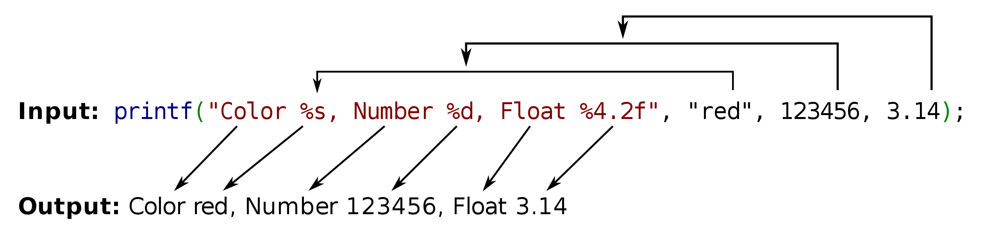

# Printf

> The project PDF:
```
https://cdn.intra.42.fr/pdf/pdf/37929/en.subject.pdf
```
> Tester:
```
https://github.com/Tripouille/printfTester
```
###List of thing you gonna pick up during this project:
First you need to learn about `Variadic variales` the structure of them and how they work behind the scene this are some links to learn about them:
First manual it in the terminal `man stdarg`.
#####What is Variadic variables 
1. GG: [Check it out.](https://www.geeksforgeeks.org/variadic-functions-in-c/)
2. GNU: [Check it out.](https://www.gnu.org/software/libc/manual/html_node/Variadic-Functions.html)
3. CPP: [Check it out.](https://en.cppreference.com/w/c/variadic)
4. To know the behavior of va_list in the code: [Check it out.](https://www.thegeekstuff.com/2017/05/c-variadic-functions/)
5. Under the hood of Va_list: [Check it out.](https://stackoverflow.com/questions/4958384/what-is-the-format-of-the-x86-64-va-list-structure#:~:text=The%20va_list%20type%20is%20an,is%20given%20in%20%EF%AC%81gure%203.34.)
6. Book of how Variadic variables works in assembly: [Check it out.](https://github.com/hjl-tools/x86-psABI/wiki/x86-64-psABI-1.0.pdf)
7. A video of how variadic variables works: [Check it out.](https://www.youtube.com/watch?v=FgvrnYScdH8&t=108s)
8. The secret of printf: [Check it out.](https://www.youtube.com/watch?v=Y9kUWsyyChk&t=751s)
9. How printf works: [Check it out.](https://www.youtube.com/watch?v=lxhrr7kgdqw&t=924s)
